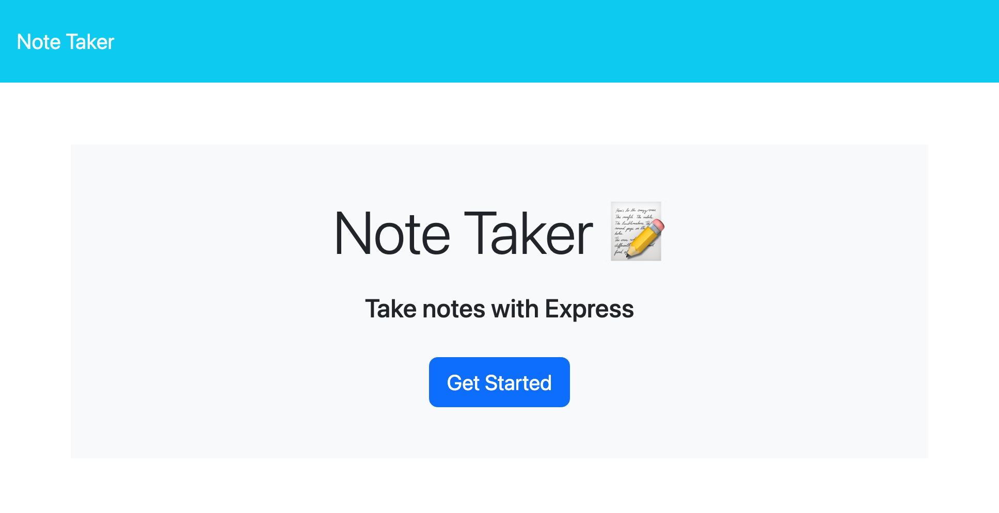
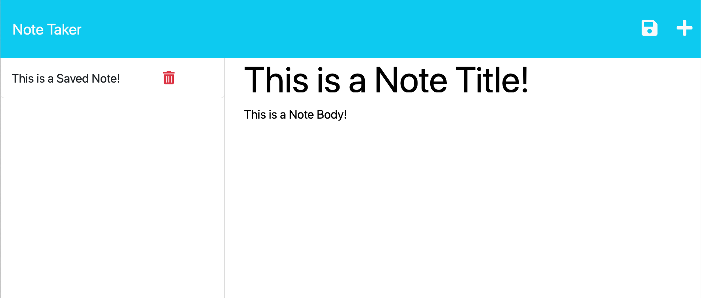

# Note Taker

## Description

This project allows the user to create a note and save it to a list. The list stores all notes on the left panel. Each note can be directly accessed by clicking on the respective note. The notes can also be deleted from the list. I got great exposure to the following concepts:

-Express server creation and maintenance 
-Methods involving writing to and receiving from API endpoints 
-Creating and calling unique ID creation functions

## Installation

[Click here to access the note taker application](https://note-taker-sb-49a4f5ea30c6.herokuapp.com/) 

## Usage

Click the Get Started button to be taken to the note list section. Click the plus symbol in the upper right hand corner to begin adding a note. The Save icon will appear next to this once a title and body have been populated. Notes will be saved in the left panel. To delete a saved note, click on the red trash can symbol next to the note name.

## Credits

SMU Coding Bootcamp 

Starter Code - [Miniature Eureka](https://github.com/coding-boot-camp/miniature-eureka)